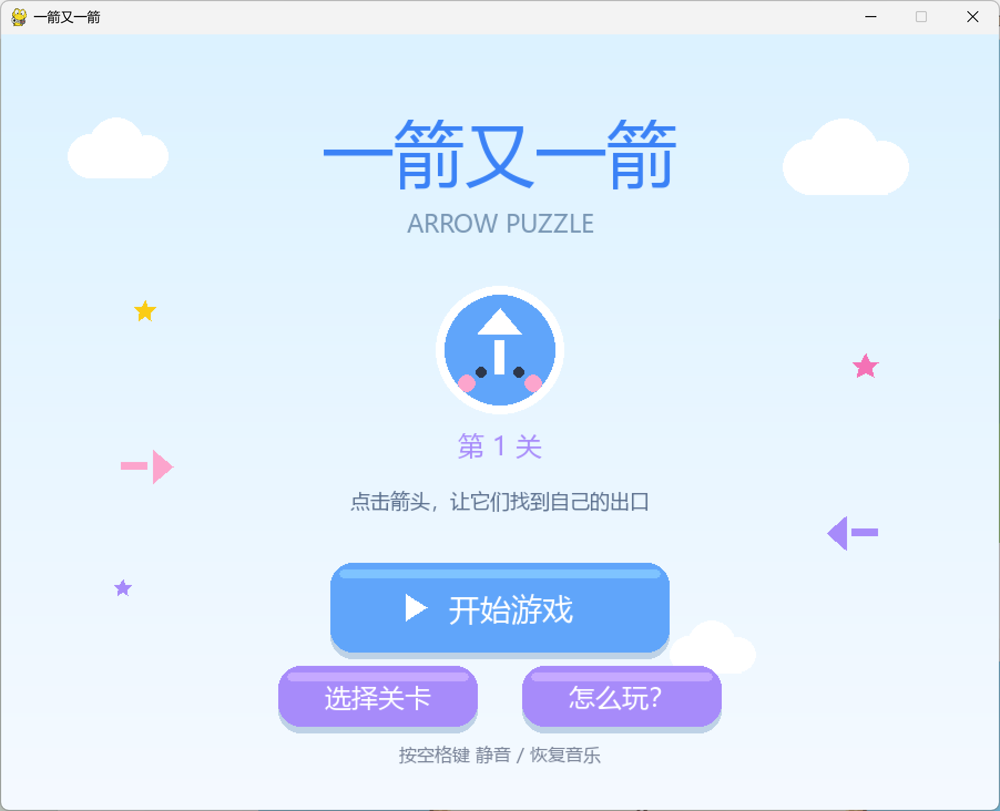
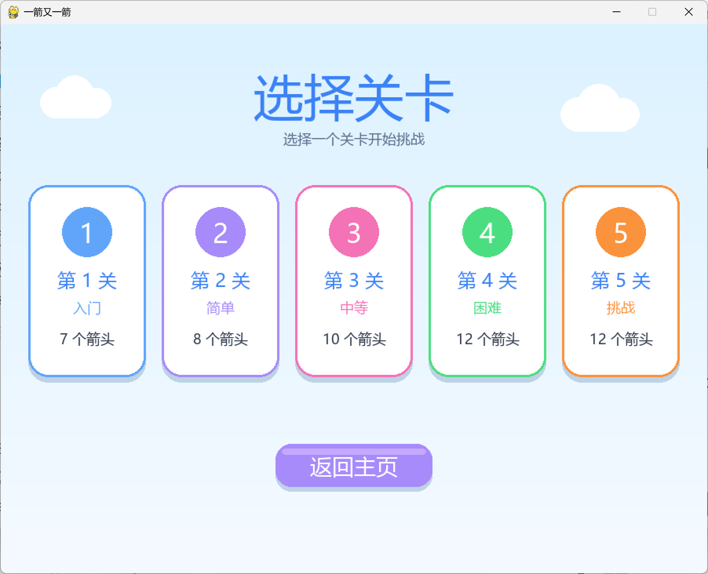
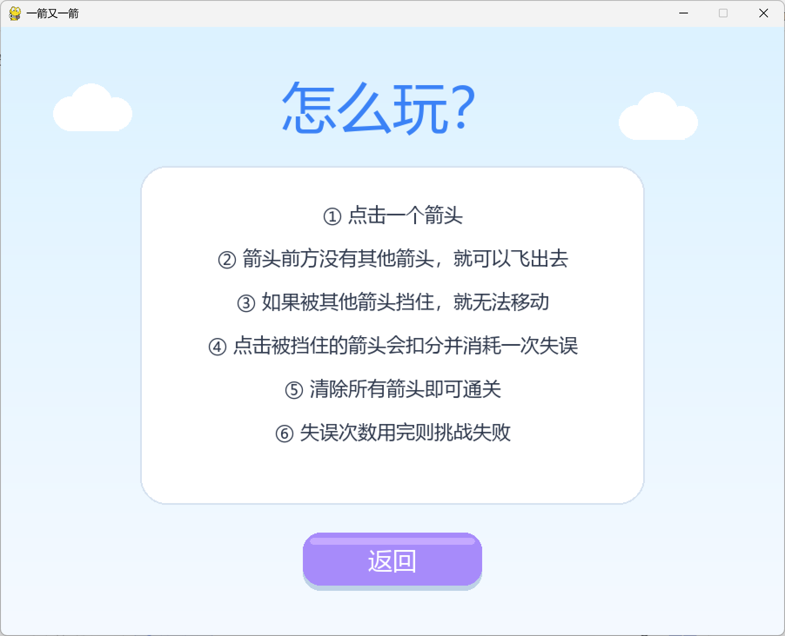
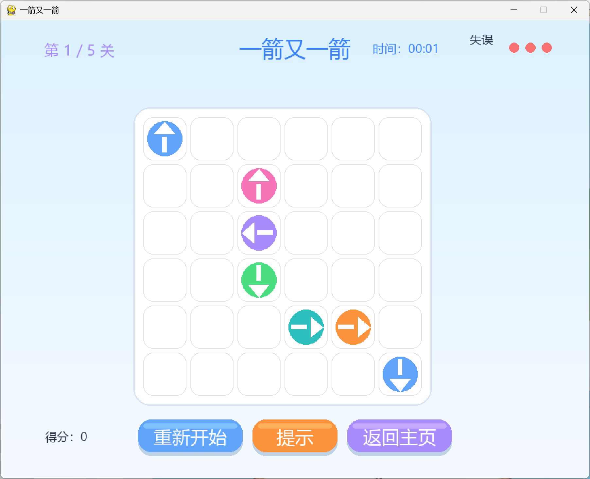
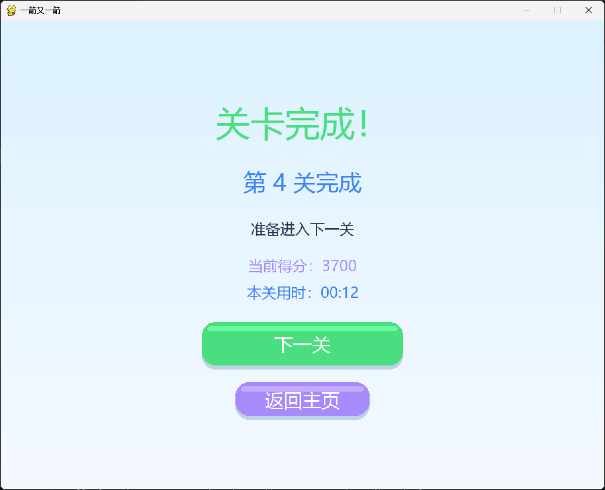
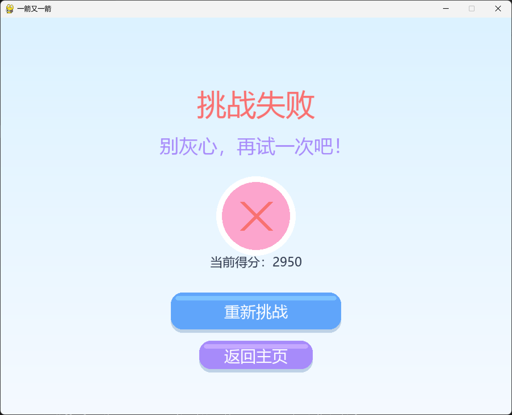
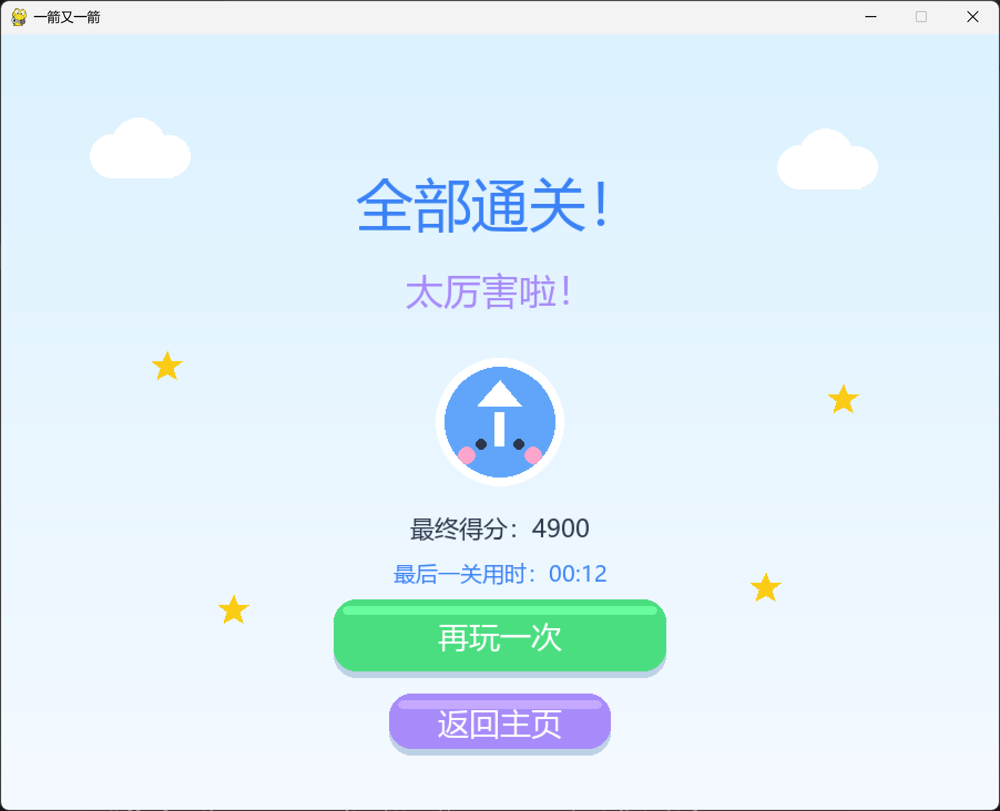
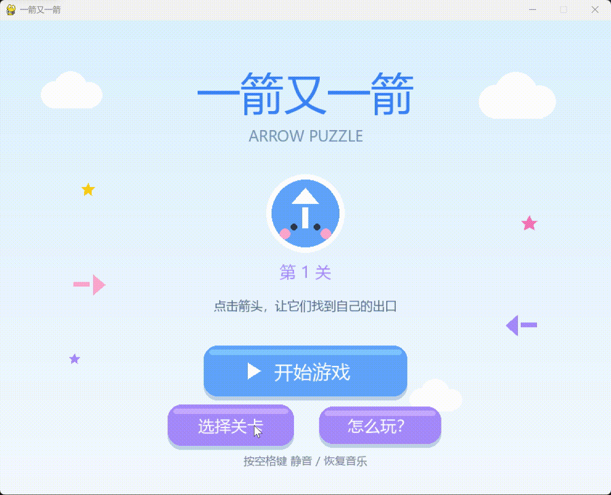

# 一箭又一箭

## 项目名称

一箭又一箭（Arrow Puzzle）

## 游戏简介

《一箭又一箭》是一款使用 Python + Pygame 开发的点击式箭头解谜小游戏。玩家需要观察箭头的方向和相互阻挡关系，按照合适的顺序点击箭头，让所有箭头依次飞出棋盘。

游戏包含开始界面、选关界面、游戏界面、通关界面和失败界面，并加入了背景音乐、飞出动画、碰撞反馈、失误次数、得分和重新开始功能。

## 开发环境

| 项目 | 环境 |
|---|---|
| 操作系统 | Windows 10 |
| Python | 3.12 |
| 图形库 | Pygame 2.6.1 |
| 开发工具 | VS Code |
| 版本控制 | Git |
| 代码托管 | GitHub |

## 安装和运行方法

### 1. 安装依赖

在项目根目录运行：

```bash
pip install pygame
```

### 2. 运行游戏

```bash
python main.py
```

### 3. 运行测试

```bash
python tests/test_core.py
```

### 4. 检查关卡是否可解

```bash
python tools/check_levels.py
```

## 游戏操作说明

- 鼠标点击箭头，让它飞出棋盘。
- 箭头前方没有阻挡时，可以飞出。
- 箭头前方有阻挡时，不能飞出，会消耗一次失误。
- 失误次数耗尽则本关失败。
- 清除本关全部箭头即可通关。
- 点击“重新开始”按钮可重置当前关卡。
- 按空格键可以静音 / 恢复背景音乐。
- 按 ESC 返回主页。

## 项目结构

```
one-arrow-game/
├── main.py              程序入口
├── core/
│   ├── board.py         棋盘规则、路径检测
│   ├── solver.py        关卡求解
│   └── levels.py        关卡数据
├── ui/
│   ├── theme.py         配色、字体、布局
│   ├── render.py        绘制工具
│   ├── animations.py    动画与粒子
│   └── game.py          状态管理与主循环
├── tests/
│   └── test_core.py     核心逻辑测试
├── tools/
│   └── check_levels.py  关卡体检工具
├── assets/
│   └── bgm.mp3          背景音乐
├── .gitignore
└── README.md
```

## 游戏截图

### 开始界面



### 选择关卡界面



### 游戏指南界面



### 游戏界面



### 通关界面



### 失败界面



### 全部通关界面



### 动画演示



## 素材来源与版权说明

- 本项目只参考“一箭又一箭”类游戏的基础玩法，没有复制原商业游戏的代码、素材、音效或关卡。
- 箭头、云朵、星星、按钮、棋盘等均由 Pygame 图形 API 绘制。
- 背景音乐来自 Pixabay，授权 CC0，可免费使用。
- 项目中未包含密码、Cookie、API Key、Token 等敏感信息。
- 本项目仅用于课程学习，不用于商业用途。